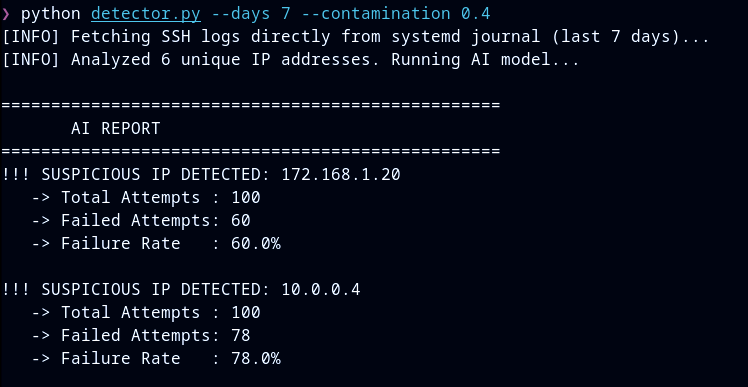

# 🛡️ AI-Powered SSH Anomaly Detector (systemd Edition)

An intelligent cybersecurity tool built with Python that directly interfaces with Linux `systemd` (`journalctl`) to detect SSH brute-force attacks and anomalous login behaviors using Machine Learning.

## 🌟 Overview
Unlike traditional rule-based firewalls (like fail2ban) that rely on static thresholds, this tool uses the **Isolation Forest** unsupervised machine learning algorithm. It analyzes behavioral patterns (total attempts, failed attempts, and failure rates) to identify suspicious IPs in real-time, making it harder for advanced attackers to bypass.

## 🚀 Features
- **Direct systemd Integration:** Reads logs natively from `journalctl` without needing static `.log` files (Optimized for modern Linux distros like Arch, CachyOS).
- **Behavioral AI Detection:** Uses `scikit-learn` to establish a baseline of "normal" behavior and flags outliers.
- **Memory Efficient:** Processes log streams line-by-line using Regex, preventing RAM overload on servers.
- **CLI Ready:** Includes `argparse` for professional command-line usage and hyperparameter tuning.

## 🛠️ Tech Stack
- **Language:** Python 3.x
- **Machine Learning:** Scikit-learn (Isolation Forest)
- **Data Manipulation:** Pandas
- **System Integration:** Subprocess, Regex (`re`)

## ⚙️ Installation

1. Clone the repository:
  
   ```bash
   git clone https://github.com/kasiruse/ai-ssh-anomaly-detector-python.git
   cd ai-ssh-anomaly-detector-python
   ```

2. Install the required dependencies:

**Arch Linux / CachyOS:**
   
   ```bash
   sudo pacman -S python-pandas python-scikit-learn
   ```

**Debian / Ubuntu:**
  
   ```bash
   sudo apt install python3-pandas python3-sklearn
   ```

**Fedora / RHEL:**
   
   ```bash
   sudo dnf install python3-pandas python3-scikit-learn
   ```

## 🎯 Usage

Run the tool directly from your terminal. *(Note: You may need `sudo` privileges to read system journal logs).*

**Basic Run (Scans last 2 days with default AI sensitivity):**
```bash
sudo python detector.py
```

**Advanced Usage (Custom parameters):**
```bash
# Scan the last 7 days and set the AI expected anomaly contamination to 10%
sudo python detector.py --days 7 --contamination 0.1
```

## 📊 Sample Output

<p align="center">
<a href="https://github.com/kasiruse/ai-ssh-anomaly-detector-python.git">
</p>

## 🤝 Disclaimer
This tool was created for educational purposes and as a proof-of-concept for integrating AI with system administration. It is not intended to replace enterprise-grade SIEM solutions.
